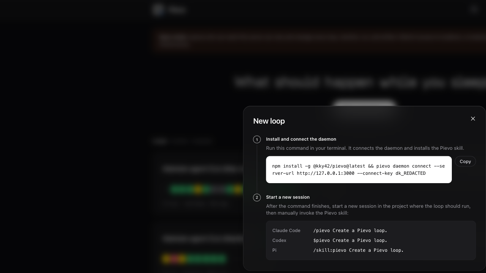
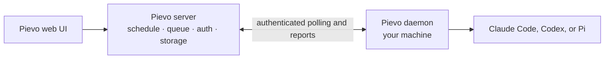

<div align="center">


# Pievo

**Run a stored coding-agent prompt on a reliable schedule, on your own machine.**

Pievo schedules Claude Code, Codex, or Pi while keeping execution, credentials, and
project files on your machine.

Pievo began as a fork of [Loopany](https://github.com/superdesigndev/loopany) by
[Superdesign](https://github.com/superdesigndev).

[](LICENSE)
[](https://github.com/kky42/pievo/stargazers)

[Source](https://github.com/kky42/pievo) · [Daemon on npm](https://www.npmjs.com/package/@kky42/pievo)

</div>


<p align="center"><sub>Example dashboard with lifecycle and tag filters, using anonymized machine and working-directory labels.</sub></p>

## What Pievo does

A loop combines a prompt, a cron or continuous schedule, a local project, and one of
three outcomes: `keep`, `no-change`, or `block`. It can also publish selected artifact
files for viewing and diffing in the web UI.

The server owns scheduling, queueing, status, and storage. The daemon runs the selected
coding agent once per delivery and durably reports the result. The server never starts
an LLM or executes user code.

## Quick start

Pievo has no default hosted service. This starts both the server and execution daemon
on one machine.

**Requirements:** Node.js `>=22.13` (`>=22.19` when using Pi) and Claude Code,
Codex, or Pi installed and authenticated.

> The daemon launches coding agents unattended with the files, commands, and
> credentials available to it. Start with a disposable project or restrict access
> with `PIEVO_ROOTS`.

### 1. Start the server

```bash
npm install -g @kky42/pievo-server@latest
pievo-server start
```

### 2. Follow the web UI

Open <http://127.0.0.1:3000>, click **New Loop**, and follow the two numbered
instructions in the dialog:



<p align="center"><sub>Example only. Your dialog supplies the real server URL and connect key.</sub></p>

The generated command is a machine credential, so treat it and your shell history as
secrets. It should report `daemon online` and `pievo skill: installed`; installation
replaces any same-named `pievo` skill. If needed, run `pievo skill install`, then
`pievo skill status`.

When setup finishes, the dashboard shows the loop and its next run. Use **Run once**
to test it immediately.

## How it works



Different loops may run concurrently, while each loop remains serialized. `keep` and
`no-change` continue its schedule; `block` pauses it.

## Run your own server

```bash
pievo-server start              # detached
pievo-server start --foreground # container, supervisor, or debugging
pievo-server status
pievo-server restart
pievo-server stop
```

The published launcher binds to localhost and stores embedded PGlite, local artifact
bytes, logs, and its pid record under `~/.pievo` by default. Use `--data-dir`, `--host`,
and `--port` to override them.

For production:

- Run exactly one server process.
- For embedded PGlite, leave `DATABASE_URL` unset, set `PIEVO_DB=pglite`, and persist
  `PIEVO_DATA_DIR`.
- For external Postgres, set `DATABASE_URL`. If it uses a transaction pooler, also set
  `DIRECT_DATABASE_URL` to a direct connection for migrations.
- Artifact bytes use `<PIEVO_DATA_DIR>/blobs` by default. Configure the complete
  `PIEVO_R2_*` set for R2-backed storage.
- Stop an embedded-PGlite server before backing up its `pgdata` and local `blobs`.
  Use your Postgres provider's online backup facilities for external Postgres.
- GitHub auth requires `GITHUB_CLIENT_ID`, `GITHUB_CLIENT_SECRET`,
  `PIEVO_AUTH_SECRET`, and the public `PIEVO_BASE_URL`. Without GitHub auth, everyone
  who can reach the server has shared administrative access, so keep it on localhost,
  a trusted private network, or behind an authenticated reverse proxy.

See [`.env.example`](.env.example) for all settings and retention controls.

### Docker

```bash
docker build -t pievo .
# Embedded database and local artifacts: persist /data and publish locally.
docker run -p 127.0.0.1:3000:3000 -e PIEVO_DB=pglite -v pievo-data:/data pievo
# External Postgres; local artifact bytes still require /data unless R2 is configured.
docker run -p 127.0.0.1:3000:3000 -e DATABASE_URL=... -e DIRECT_DATABASE_URL=... -v pievo-data:/data pievo
```

[`fly.toml`](fly.toml) and [`fly.prod.toml`](fly.prod.toml) are optional
single-process deployment examples.

## Upgrade

```bash
npm update -g @kky42/pievo-server
pievo-server restart
npm install -g @kky42/pievo@latest
pievo daemon restart
```

> **Upgrading a former team-enabled installation:** back up the database before the
> `0002_remove_teams` migration. It removes teams, memberships, roles, and invitations;
> resources remain owned by their stored `user_id`. Upgrade the server and migration
> together, and do not run an older server afterward.

## License

[MIT](LICENSE). Both [`@kky42/pievo`](packages/daemon/LICENSE) and
[`@kky42/pievo-server`](packages/server/LICENSE) are MIT licensed.
