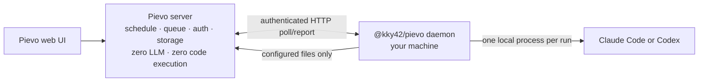

<div align="center">


# Pievo

**Run a stored coding-agent prompt on a reliable schedule, on your own machine.**

Pievo is a self-hosted scheduler and status ledger. Its server stores configuration,
queues runs, and serves the web UI; the `@kky42/pievo` daemon executes Claude Code or
Codex locally with your credentials and tools.

[](LICENSE)
[](https://github.com/kky42/pievo/stargazers)

[Source](https://github.com/kky42/pievo) · [Daemon on npm](https://www.npmjs.com/package/@kky42/pievo) · [Contributing](CONTRIBUTING.md) · [Architecture](AGENTS.md)

</div>

## What Pievo does

A loop contains:

- one exclusive schedule: cron, or continuous delay after the previous terminal run;
- one absolute working-directory path and coding agent (`claude-code` or `codex`);
- a server-stored user prompt;
- definitions for `keep`, `no-change`, and `block`;
- optional exact artifact paths relative to the working directory.

At run time, Pievo sends the stored prompt unchanged, then appends only the status
definitions and this required contract:

```text
Before finishing, call exactly once:
pievo report --message "<summary>" --status <keep|no-change|block>
```

The daemon starts the selected coding-agent CLI once in the configured directory.
The server never starts an LLM or executes user code: it schedules, authenticates,
stores bytes, and computes database and display results. Execution is BYOA—on the
machine you connected, using its local files, tools, and provider credentials.

### Scheduling and outcomes

- **Cron** requires an IANA timezone and an overlap policy. `skip` consumes an
  occurrence if the prior run is still open; `queue-one` retains at most one
  coalesced follow-up.
- **Continuous** waits the configured number of minutes after a terminal run and
  never overlaps itself.
- **Run once** enters the same durable per-loop queue as scheduled work.
- `keep` and `no-change` continue the schedule. `block` records the result and
  pauses the loop. Consecutive execution errors also pause it at
  `PIEVO_FAILURE_AUTOPAUSE_STREAK` (default `3`, `0` disables the breaker).

Every run retains phase and timing, the agent report, process exit information,
provider session ID, final assistant text, and normalized token usage. Pievo does not
store provider event streams and never resumes a provider session.

Configured artifacts are collected after the coding agent exits. Paths are exact—no
globs—and are checked against lexical and symlink escapes. Missing files do not fail
the run. Files over 10 MB are metadata-only; smaller files use content-addressed
storage and per-run snapshots for the web viewer and diffs.

## Quick start

Pievo has no default hosted service. This path runs the server and daemon on one
machine; a team may later connect other machines to the same server.

### Prerequisites

- Node.js `>=22.13`
- Claude Code or Codex installed and authenticated on the execution machine

> **Local execution is powerful.** The daemon launches the selected coding agent in
> unattended mode, where it can use the files, commands, and credentials available to
> that process. Start with a disposable project or a restrictive `PIEVO_ROOTS` jail.

### 1. Start a local server

```bash
npm install -g @kky42/pievo-server@latest
pievo-server start
```

The server starts detached at <http://127.0.0.1:3000>. By default the published
launcher uses embedded PGlite and stores the database, local artifact bytes, pid
record, and log under `~/.pievo`.

```bash
pievo-server status
```

### 2. Connect the execution machine and create a loop

1. Open <http://127.0.0.1:3000> and select **New Loop**.
2. Paste the connect command shown in the modal into a foreground Claude Code or
   Codex session in the project you want to schedule.
3. In that same session, tell the agent: **“Create a Pievo loop.”**

The agent uses Pievo's installed owner skill to gather and confirm the prompt,
schedule, status meanings, and optional artifact paths, then validates and creates the
loop. Close the modal and the dashboard's normal refresh will show it. A continuous
loop is immediately eligible; a cron loop shows its next occurrence. Use **Run once** to exercise either
schedule immediately.

Useful commands:

```bash
pievo                    # machine-local home
pievo loops              # loops bound to this machine
pievo show <loop> --full # stored configuration
pievo log <loop>         # bounded run history
pievo daemon status
pievo --help
```

Upgrade the daemon explicitly:

```bash
npm install -g @kky42/pievo@latest
pievo daemon restart
```

## How it works



1. The server keeps recurring schedule facts and pending run rows in Postgres.
   In-process timers reduce latency, but database facts and daemon polls are
   authoritative after restarts.
2. A daemon poll atomically claims at most one ready run and creates a durable,
   hashed run lease. Different loops may execute concurrently; each loop stays
   serialized.
3. The in-run `pievo` credential can only submit the required report. After the
   provider exits, the daemon collects configured artifacts and commits the exact
   terminal payload to a local SQLite outbox.
4. The outbox retries until the server returns a definitive report-ID-bound receipt.
   Machine sleep and server restarts are reconciled without discarding the saved
   result or blocking unrelated loops.
5. The web UI shows lifecycle, machine presence, run history, reports, provider
   diagnostics, artifacts, and bounded per-run diffs.

## Run your own server

### Published server launcher

```bash
npm install -g @kky42/pievo-server@latest
pievo-server start              # detached
pievo-server start --foreground # container/supervisor/debugging
pievo-server status
pievo-server restart
pievo-server stop
```

The default bind is deliberately local-only. `--data-dir`, `--host`, and `--port`
select the instance and bind; equivalent environment variables are
`PIEVO_DATA_DIR`, `HOST`/`NITRO_HOST`, and `PORT`/`NITRO_PORT`. Restart preserves the
recorded host and port unless flags or bind environment variables override them.
Before binding to `0.0.0.0`, configure authentication and network controls.

The launcher verifies pid plus process start time, runs migrations before readiness,
and records `server.pid` and `server.log` in the data directory. It never updates npm:

```bash
npm update -g @kky42/pievo-server
pievo-server restart
```

### Source development

```bash
git clone https://github.com/kky42/pievo
cd pievo
corepack enable
pnpm install
pnpm dev # http://127.0.0.1:3000
```

Development defaults to open access, embedded PGlite at `~/.pievo/pgdata`, and local
artifact bytes at `~/.pievo/blobs`. For development-only environment settings, copy
[`.env.example`](.env.example) to `packages/server/.env`. Production startup and Docker
do not load that file; pass real environment variables through the host.

### Production database and storage

Build and run the Nitro server with exactly one process:

```bash
pnpm install
pnpm build
pnpm start
```

Choose one database tier:

- **External Postgres:** set `DATABASE_URL`. For a Supabase transaction pooler
  (`:6543`), also set `DIRECT_DATABASE_URL` to the direct/session (`:5432`) URL;
  migrations refuse to run through the transaction pooler.
- **Embedded PGlite:** leave `DATABASE_URL` unset, set `PIEVO_DB=pglite`, and place
  `PIEVO_DATA_DIR` on durable storage. Production fails closed without this explicit
  opt-in so a lost database secret cannot silently create an empty database.

Artifact bytes default to `<PIEVO_DATA_DIR>/blobs`. A complete `PIEVO_R2_*`
configuration selects R2; `PIEVO_BLOB_STORE=local|r2|memory` can select explicitly.
`memory` is an acknowledged data-loss mode and loses all artifact bytes at restart.
The database stores artifact metadata even when bytes use local or R2 storage.

> **Backups:** stop an embedded-PGlite server before copying its live `pgdata`
> directory, and back up local `blobs` with it. Use external Postgres for online
> database backup facilities.

### Authentication and teams

GitHub authentication is enabled only when both `GITHUB_CLIENT_ID` and
`GITHUB_CLIENT_SECRET` are set. Then `PIEVO_AUTH_SECRET` is mandatory; also set the
public `PIEVO_BASE_URL`. `PIEVO_ALLOWED_LOGINS` accepts exact emails or domain
wildcards. An empty allowlist permits any GitHub user to sign in.

> With GitHub credentials unset, Pievo is an open shared workspace. Do not expose that
> mode to an untrusted network.

Authenticated users receive personal teams and may belong to additional teams. Loop
and artifact reads are membership-scoped; machine device tokens remain visible only
to the machine owner.

### Docker

```bash
docker build -t pievo .
# Embedded database and local artifacts: persist /data.
docker run -p 3000:3000 -e PIEVO_DB=pglite -v pievo-data:/data pievo
# External Postgres; local artifact bytes still require /data.
docker run -p 3000:3000 -e DATABASE_URL=... -e DIRECT_DATABASE_URL=... -v pievo-data:/data pievo
```

External Postgres plus R2 needs no local data volume. [`fly.toml`](fly.toml) and
[`fly.prod.toml`](fly.prod.toml) are reusable single-process examples; this repository
owns no Fly app or origin and its deployment workflows are manual-only.

## Development

```bash
pnpm -r test
pnpm -r typecheck
```

See [`CONTRIBUTING.md`](CONTRIBUTING.md) for contributor and release procedures, and
[`AGENTS.md`](AGENTS.md) for architecture invariants and sharp edges.

## License

[MIT](LICENSE). Both [`@kky42/pievo`](packages/daemon/LICENSE) and
[`@kky42/pievo-server`](packages/server/LICENSE) are MIT licensed.
