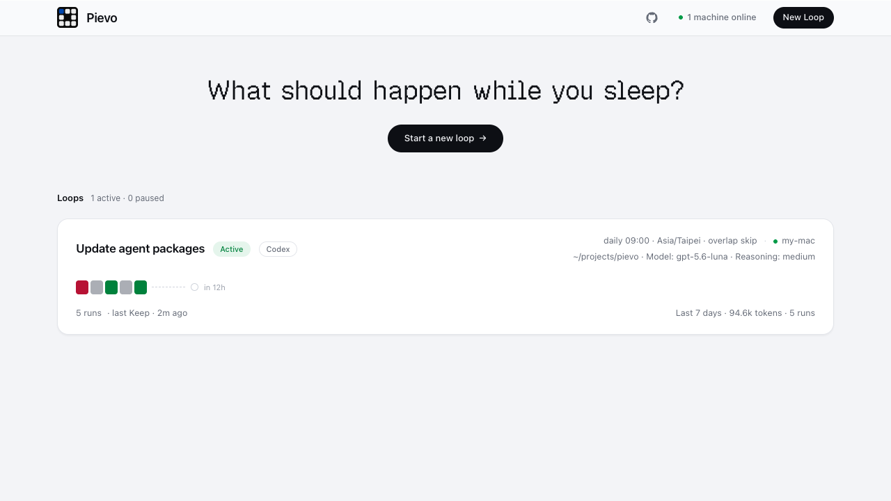

<div align="center">


# Pievo

**Run a stored coding-agent prompt on a reliable schedule, on your own machine.**

Pievo is a self-hosted scheduler and status ledger. Its server stores configuration,
queues runs, and serves the web UI; the `@kky42/pievo` daemon executes Claude Code,
Codex, or Pi locally with your credentials and tools.

[](LICENSE)
[](https://github.com/kky42/pievo/stargazers)

[Source](https://github.com/kky42/pievo) · [Daemon on npm](https://www.npmjs.com/package/@kky42/pievo)

</div>



<p align="center"><sub>Example dashboard; machine and working-directory labels are anonymized.</sub></p>

## What Pievo does

Each loop combines a stored prompt with:

- a cron schedule or continuous delay;
- a local working directory and Claude Code, Codex, or Pi;
- `keep`, `no-change`, and `block` outcomes;
- optional exact artifact paths for viewing and diffing in the web UI.

The daemon runs the selected coding agent once per delivery and reports the result
through a durable local outbox. `keep` and `no-change` continue the schedule; `block`
pauses it. **Run once** uses the same queue as scheduled work.

The server never starts an LLM or executes user code. Execution stays on the connected
machine and uses its local files, tools, and provider credentials.

## Quick start

Pievo has no default hosted service. This path runs the server and daemon on one
machine; you may later connect other machines to the same server.

### Prerequisites

- Node.js `>=22.13` (Pi 0.82.1 itself requires Node.js `>=22.19`)
- Claude Code, Codex, or Pi installed and authenticated on the execution machine

> **Local execution is powerful.** The daemon launches the selected coding agent in
> unattended mode, where it can use the files, commands, and credentials available to
> that process. Start with a disposable project or a restrictive `PIEVO_ROOTS` jail.

> **Upgrade warning:** back up the database before upgrading across
> `0002_remove_teams`. This destructive, backward-incompatible migration removes
> team, membership, role, and invitation records while preserving each machine and
> loop's stored `user_id`. Former team collaborators lose access to resources they
> do not own by that field. Upgrade the server and database migration together; do
> not run an older server binary afterward. Hosted Postgres migrates through the
> direct prestart connection; PGlite migrates in-process during server boot.

### 1. Start a local server

```bash
npm install -g @kky42/pievo-server@latest
pievo-server start
```

The server starts detached at <http://127.0.0.1:3000>. By default the published
launcher uses embedded PGlite and stores the database, local artifact bytes, pid
record, and log under `~/.pievo`.

```bash
pievo-server status
```

### 2. Connect the execution machine and create a loop

1. Open <http://127.0.0.1:3000> and select **New Loop**.
2. Run the connect command shown in the modal in a terminal. The `dk_…` value is a
   persistent machine bearer credential and appears in that command, so treat the
   command and your shell history as secrets.
3. Confirm that the command prints `daemon online` and `pievo skill: installed`.
   Pievo copies the current CLI's bundled skill to the Claude and universal agent
   user directories, replacing any same-named `pievo` skill. If installation was
   skipped, run `pievo skill install` and verify with `pievo skill status`.
4. Start a fresh Claude Code, Codex, or Pi session in the project you want to schedule,
   then tell the agent: **“Create a Pievo loop.”**

The fresh session discovers Pievo's owner skill, gathers and confirms the prompt,
schedule, status meanings, and optional artifact paths, then validates and creates the
loop. Close the modal and the dashboard's normal refresh will show it. A continuous
loop is immediately eligible; a cron loop shows its next occurrence. Use **Run once**
to exercise either schedule immediately.

Useful commands:

```bash
pievo                    # machine-local home
pievo loops              # loops bound to this machine
pievo show <loop> --full # stored configuration
pievo log <loop>         # bounded run history
pievo daemon status
pievo --help
```

Upgrade the daemon explicitly:

```bash
npm install -g @kky42/pievo@latest
pievo daemon restart
```

## How it works


The server owns schedules and queued runs. The daemon polls for work, runs the coding
agent locally, then durably retries its report until the server accepts it. Different
loops may run concurrently, while each individual loop remains serialized.

## Run your own server

### Published server launcher

```bash
npm install -g @kky42/pievo-server@latest
pievo-server start              # detached
pievo-server start --foreground # container/supervisor/debugging
pievo-server status
pievo-server restart
pievo-server stop
```

The default bind is deliberately local-only. `--data-dir`, `--host`, and `--port`
select the instance and bind; equivalent environment variables are
`PIEVO_DATA_DIR`, `HOST`/`NITRO_HOST`, and
`PORT`/`NITRO_PORT`/`PIEVO_PORT`. Restart preserves the
recorded host and port unless flags or bind environment variables override them.
Before binding to `0.0.0.0`, configure authentication and network controls.

Upgrade explicitly; restart does not update npm:

```bash
npm update -g @kky42/pievo-server
pievo-server restart
```

### Production database and storage

Run exactly one server process and choose one database tier:

- **External Postgres:** set `DATABASE_URL`. For a Supabase transaction pooler
  (`:6543`), also set `DIRECT_DATABASE_URL` to the direct/session (`:5432`) URL;
  migrations refuse to run through the transaction pooler.
- **Embedded PGlite:** leave `DATABASE_URL` unset, set `PIEVO_DB=pglite`, and place
  `PIEVO_DATA_DIR` on durable storage. Production fails closed without this explicit
  opt-in so a lost database secret cannot silently create an empty database.

Artifact bytes default to `<PIEVO_DATA_DIR>/blobs`. A complete `PIEVO_R2_*`
configuration selects R2; `PIEVO_BLOB_STORE=local|r2|memory` can select explicitly.
`memory` is an acknowledged data-loss mode and loses all artifact bytes at restart.
The database stores artifact metadata even when bytes use local or R2 storage.

> **Backups:** stop an embedded-PGlite server before copying its live `pgdata`
> directory, and back up local `blobs` with it. Use external Postgres for online
> database backup facilities.

### Access modes

GitHub authentication is enabled only when both `GITHUB_CLIENT_ID` and
`GITHUB_CLIENT_SECRET` are set; setting exactly one makes startup fail rather than
falling back to open mode. Then `PIEVO_AUTH_SECRET` is mandatory; also set the
public `PIEVO_BASE_URL`. `PIEVO_ALLOWED_LOGINS` accepts exact emails or domain
wildcards. An empty allowlist permits any GitHub user to sign in.

In auth mode, the signed-in user is the isolation boundary: users can access only
machines, loops, runs, and artifacts stored under their `user_id`. Sharing is not
supported. Team creation, switching, membership, roles, and invitations do not exist.

> **Open mode is shared administrative access.** With GitHub credentials unset,
> anyone who can reach the server can view and manage every resource, including
> machine reconnect credentials. Restrict it to localhost, a trusted private
> network, or an authenticated reverse proxy. Never expose open mode directly to the
> public internet.

### Docker

```bash
docker build -t pievo .
# Embedded database and local artifacts: persist /data; publish locally only.
docker run -p 127.0.0.1:3000:3000 -e PIEVO_DB=pglite -v pievo-data:/data pievo
# External Postgres; local artifact bytes still require /data.
docker run -p 127.0.0.1:3000:3000 -e DATABASE_URL=... -e DIRECT_DATABASE_URL=... -v pievo-data:/data pievo
```

External Postgres plus R2 needs no local data volume. [`fly.toml`](fly.toml) and
[`fly.prod.toml`](fly.prod.toml) are optional single-process deployment examples.

## License

[MIT](LICENSE). Both [`@kky42/pievo`](packages/daemon/LICENSE) and
[`@kky42/pievo-server`](packages/server/LICENSE) are MIT licensed.
